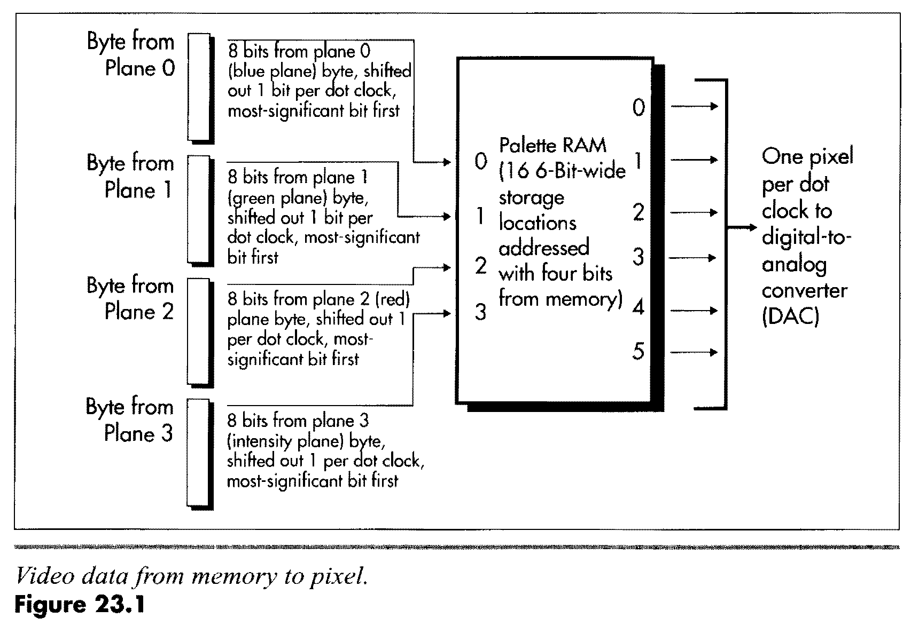
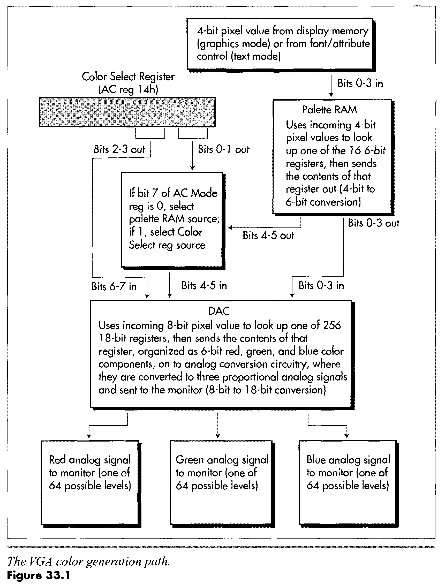

# VgaDump
DrunkenIronman allows taking screenshots of Blue Screens
*from within* the crashing system.

This is implemented by taking a dump of VGA memory and storing
it in the crash dump file (`bugshot` subfunction).
Later on, the user can use the `convert` subfunction to extract
the data from the crash dump and convert it to a BMP.

## The VGA
First, some background info:

> **Video Graphics Array (VGA)** refers specifically to the display
> hardware first introduced with the IBM PS/2 line of computers in 1987...

> VGA was the last IBM graphics standard to which the majority of
> PC clone manufacturers conformed, making it the lowest common
> denominator that virtually all post-1990 PC graphics hardware
> can be expected to implement.

> ([*Wikipedia, The Free Encyclopedia*][1]).

For our purposes, however, it is only necessary to understand
that Windows (up until Windows 8, and maybe even after that)
falls back to VGA when displaying a BSoD. Specifically,
it falls back to a **VGA mode 12H**, which has a resolution
of **640x480** and a **16-color** palette.

But how does it work?

## VGA Planes
The VGA memory is organized into four planes of 64K each,
for a total of 256K video memory. All planes are addressed
starting from physical address `0xA0000`, and the current
read and write modes determine from which plane pixel data
is read, and how it is written back.

Each plane provides a single bit of data for each pixel
on the screen, for a total of 4 bits of color data
per pixel: plane 0 provides the first bit, plane 1 -
the second, and so on. Pixels are ordered beginning
with the MSB: the MSB of the first byte provides
data for the top-left pixel on the screen, the next
most significant bit provides data for the next pixel,
and so on. This is best illustrated by the following
diagram, from Michael Abrash's *Graphics Programming Black Book*:

Since we have only 4 bits of data per pixel,
we can now understand why this VGA mode has only 16 colors.

## Color Translation

Note that the diagram above also includes the Palette RAM.
The *Black Book* clarifies:

> The color path in the VGA involves two stages... The first
> stage fetches a 4-bit pixel from display memory and feeds it into the
> EGA-compatible palette RAM (so called because it is functionally equivalent
> to the palette RAM color translation circuitry of the EGA), which translates
> it into a 6-bit value and sends it on to the DAC. The transladon involves
> nothing more complex than the 4-bit value of a pixel being used as the
> address of one of the 16 palette RAM registers; a pixel value
> of O selects the contents of palette RAM register 0, a pixel value of 1
> selects register 1, and so on. Each palette RAM register stores 6 bits, so
> each time a palette RAM register is selected by an incoming 4-bit pixel
> value, 6 bits of information are sent out by the palette RAM.

What is the DAC, you ask? Good question:

> Once the EGA-compatible palette RAM has fulfilled its karma and performed
> 4-bit to 6-bit translation on a pixel, the resulting value is sent to the
> DAC (Digital/Analog Converter). The DAC performs an 8-bit to 18-bit
> conversion in much the same manner as the palette RAM, converts the 18-bit
> result to analog red, green, and blue signals (6 bits for each signal),
> and sends the three analog signals to the monitor.

The important thing to understand here is that during the whole
translation process there is no color to speak of, only indices
to palettes. Only during the final translation by the DAC
do we get a real color out to the screen.

You have probably noticed that the last diagram also includes
the Color Select Register, which influences the value
that gets input to the DAC. On Windows, the indicated 4 bits
of the Color Select Register are 0, and so the DAC's input
is simply the output from the Palette RAM.

Moreover, Windows programs the Palette RAM into pass-through
mode by mapping each of the 16 entries to its corresponding
index. This way, the output from the Palette RAM is simply
the input from the VGA memory.

Finally, Windows programs the DAC with the desired colors and the party is on.

As a side note, this is how the NotMyFault application allows
you to change the color of the Blue Screen: it loads a driver
that reprograms the DAC palette with the user's chosen colors.

## VGA Registers
We have talked about the memory layout and the colors, but
how do we actually read any of it? To understand this,
we should first talk about the VGA registers.

The VGA chip contains a boatload of different registers,
accessible using the `in` and `out` instructions
(from kernel-mode, of course). In most cases, the registers
are accessed via a pair of ports - an index port and a data port.

The way to use them is as follows:
1. Write the index of the desired register into the index port.
2. Read/write the data from/to the data port.

Specifics will be explained below.

### Reading the DAC Palette
Reading the DAC palette is a fairly simple operation, and it also
does not conform to the usual way of accessing VGA registers:

1. Write the index you wish to read to the DAC Address Read
   Mode Register (`0x3C7`).
2. Perform three successive reads from the DAC Data Register (`0x3C9`),
   retrieving the red, green and blue values.

The current index will auto-increment after three reads from
the data registers, so reading the whole palette is really simple.

### Reading the Video Memory
We'll have to work a little hard to dump the video memory. Here's
the simplest way of doing it:

1. Set the read mode to 0. In this mode we can read raw bytes from
   one plane at a time. There are actually other read modes out
   there that perform some clever bit-twiddling on the values
   read from the video memory before returning them. To enter
   this mode we set bit 3 of the Graphics Mode Register to 0.
   The Graphics Mode Register is register index 5 in the
   Graphics Controller, whose index register is at port `0x3CE`
   and whose data register is at port `0x3CF`.
2. Write the plane we wish to read from to the Read Map Select Register.
   This is index 4 in the Graphics Controller.
3. Copy data from the plane, starting from physical address `0xA0000`.
4. Repeat 2-3 for all other planes.

## Putting It All Together
Now that we have a complete dump of both the VGA memory and the DAC palette
we can reconstruct the state of the screen after recovering from
the system crash. In essence, we will be doing the VGA's job by
parsing the pixel data and converting it into a more readable
format.

All of this is implemented in the user-mode part of DrunkenIronman.

## Further Reading
- Michael Abrash's [*Graphics Programming Black Book*][2].
  This is probably the best source of information on VGA programming.
- [The FreeVGA Project][3].
- [VGA Hardware @ OSDev Wiki][4].
- [The ReactOS source][5], for reference on BSoD handling in the kernel.

[1]: https://en.wikipedia.org/wiki/Video_Graphics_Array
[2]: http://www.drdobbs.com/parallel/graphics-programming-black-book/184404919
[3]: http://www.osdever.net/FreeVGA/home.htm
[4]: http://wiki.osdev.org/VGA_Hardware
[5]: https://doxygen.reactos.org/
