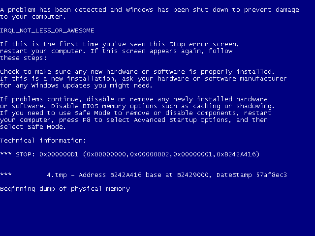
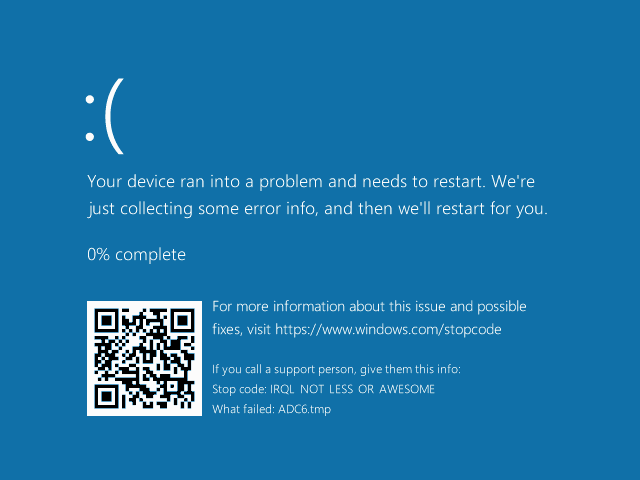

# DrunkenIronman
Taking the Death out of the Blue Screen.


## Features
- Taking screenshots of BSoDs in the wild. ([Documentation](Docs/VgaDump.md)).
- Customizing the message displayed on the Blue Screen.
  ([Documentation](Docs/Carpenter.md)).


## Usage
Make sure memory dumps are enabled if you intend
to capture screenshots.

The software has been tested on the following *virtual machines*:
- Windows XP SP3 x86
- Windows 10 14393 x86
- Windows 10 19043 x64

YMMV.

```
DrunkenIronman.exe <subfunction> <subfunction args>

  convert [<input>] <output>
    Extracts a screenshot from a memory dump.

  load
    Loads the driver.

  unload
    Unloads the driver.

  bugshot [<width> <height>]
    Instructs the driver to capture a screenshot
    of the next BSoD.
    The width and height parameters are used only on Windows 10+,
    to define the maximum size of the captured image. They are ignored
    on earlier systems, and on Windows 10 if the BSoD is generated in VGA mode.
    If not specified, the default is 640x480.

  vanity <string>
    Crashes the system and displays the specified string
    on the BSoD.

  qr
    Displays the dimensions of the current QR image.

  qr <image>
    Sets an image to be used instead of the default QR code.
    The image must be a non-compressed BMP
    with either 32 or 24 BPP, and with the same dimensions
    as the default QR image.
```

### Examples

#### Conversion
```
DrunkenIronman.exe convert out.bmp
DrunkenIronman.exe convert C:\Some\Path\MEMORY.DMP out2.bmp
```

#### Custom Bugcheck Message
```
DrunkenIronman.exe vanity IRQL_NOT_LESS_OR_AWESOME
```

#### Custom QR image
```
DrunkenIronman.exe qr C:\Some\Path\image.bmp
```


## Screenshots



