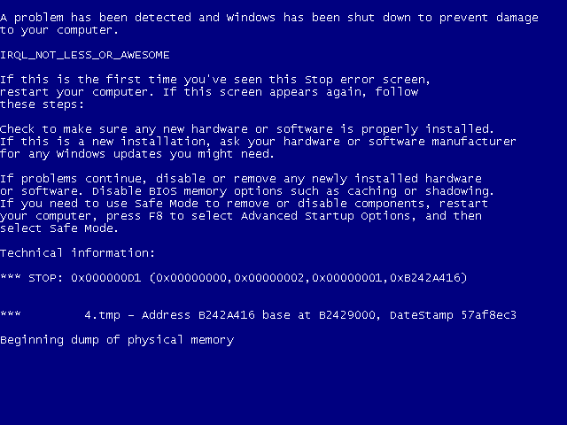

# DrunkenIronman
Taking the Death out of the Blue Screen.


## Features
- Taking screenshots of BSoDs in the wild. ([Documentation](Docs/VgaDump.md)).
- Customizing the message displayed on the Blue Screen.


## Usage
Make sure memory dumps are enabled if you intend
to capture screenshots.

The software has been tested only on Windows XP SP3. YMMV.

```
DrunkenIronman.exe <subfunction> <subfunction args>

  convert [input] output
    Extracts a screenshot from a memory dump.

  load
    Loads the driver.

  unload
    Unloads the driver.

  bugshot
    Instructs the driver to capture a screenshot
    of the next BSoD.

  vanity string
    Crashes the system and displays the specified string
    on the BSoD.
```

### Examples

#### Conversion
```
DrunkenIronman.exe convert out.bmp
DrunkenIronman.exe convert C:\Some\Path\MEMORY.DMP out2.bmp
```

#### Custom Bugcheck Message
```
DrunkenIronman.exe vanity IRQL_NOT_LESS_OR_AWESOME
```


## Screenshots

